# Usage guide

Everything you need to drive s3b day to day — in the GUI and on the
terminal. The same content lives in the app (Help → **User guide**, F1)
and in the supported-sources overview (Help → **Supported data
sources**); this page is the long-form version with screenshots.

```
Table of contents
  1. Getting started
  2. Supported data sources
  3. Browsing
  4. Transfers — and migrating between sources
  5. Versions & the safety ladder
  6. Bucket administration
  7. Security features
  8. Keyboard map
  9. CLI quick reference
```

---

## 1. Getting started

Install the [release artifact](../../releases) for your platform (or
[build from source](../README.md#quickstart-gui)) and start it: `s3b`
with no arguments opens the desktop app, `s3b <args>` is the CLI —
one binary, same engine.

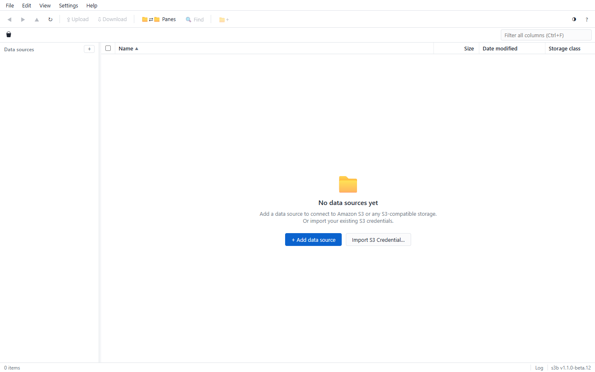

### Add a data source

Click the **+** next to *DATA SOURCES* in the sidebar (or the button on
the empty state). Every connection — an S3 endpoint, an SFTP server, an
FTP site, a WebDAV share, a local folder — is a *data source*; click one
in the tree to browse it in the main view. Sources are color-coded, and
each carries a live connectivity ball (green = reachable).

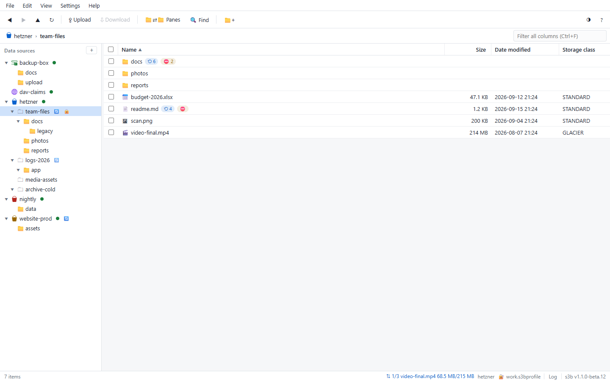

### Import existing credentials

Don't retype what you already have. **Import S3 Credential** (File menu
or the welcome screen) reads:

- **AWS INI** — `~/.aws/credentials` + `~/.aws/config`; profiles with an
  `endpoint_url` become MinIO / R2 / Wasabi / … sources, plain profiles
  connect to Amazon S3
- **rclone** and **JSON** config files, `.env` files
- **Encrypted `.s3bprofile`** containers (your saved workspaces)
- **KMS / secrets services** — HashiCorp Vault, AWS Secrets Manager,
  Azure Key Vault, GCP Secret Manager — including fully custom HTTP
  endpoints (URL / JSON path / headers)

Every candidate is listed with a live **bucket-count test** before you
commit; import it and the bucket's content opens immediately.

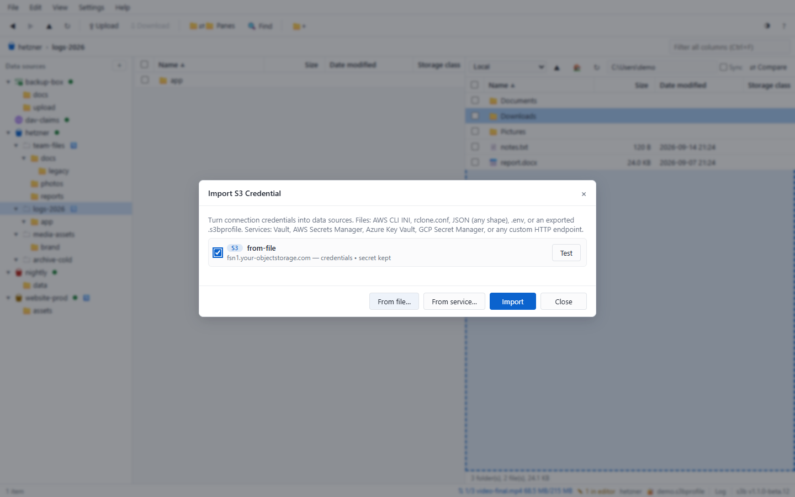

### Save your workspace

Data sources live in the session until saved — the status bar counts
unsaved sources. **Ctrl+S** / File → *Save As* writes an encrypted
`.s3bprofile` (scrypt + AES-256-GCM, password of your choice) you can
reopen, keep or share. On first launch the welcome screen disappears
for good as soon as one source exists.

### Where secrets live

Keys and passwords go to the **OS keyring** — Windows Credential
Manager, macOS Keychain, Linux SecretService — with a `0600`-permission
file fallback on headless hosts. Secrets are masked in all output and
never written to logs. See [security.md](security.md) for the full
model, including the opt-in **Secure Storage** mode that encrypts the
whole source store as one AES-256-GCM envelope.

---

## 2. Supported data sources

One UI, one CLI, one transfer engine — the source type changes, nothing
else does.

| Kind | Protocols | Notes |
|---|---|---|
| S3-compatible | `s3://` | Amazon S3, MinIO/AIStor, Wasabi, Cloudflare R2, Backblaze B2, DigitalOcean Spaces, IBM COS, Hetzner Storage Boxes, Ceph RGW, Dell ECS, NetApp StorageGRID — provider quirks are detected and surfaced before a request fails |
| Remote filesystems | `sftp://` `scp://` | SSH; host, port 22 default, password auth, anchored root path |
| | `ftp://` `ftps://` | plain and TLS; ports 21/990 defaults |
| | `webdav://` `webdavs://` | RFC 4918 over HTTP(S); Apache, nginx, rclone serve webdav, Nextcloud, IIS |
| Local filesystem | — | the dual-pane side (F9) browses local drives; any source type can be bound to it |

An S3 source is either **account-wide** (all buckets the key can list)
or **bucket-scoped** — `s3b source add s3://my-bucket` or the `--bucket`
option pins it to one bucket, which is what credential imports create.
On the CLI every source is reachable as a URI (`hetzner://bucket/prefix`,
`vault://media/…`) with the same flags everywhere.

All of them browse, upload, download, rename and delete like any other
source — and join the same transfer matrix (drag & drop, copy/paste,
directory compare) with S3 and the local pane.

---

## 3. Browsing

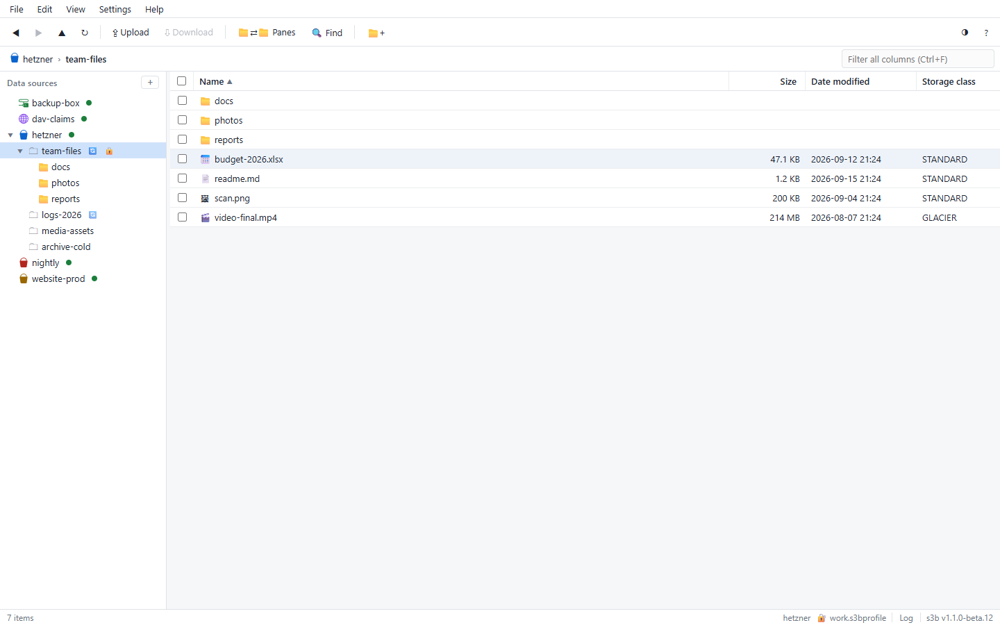

- **Sidebar tree** — sources → buckets → folders. Click to navigate;
  right-click a node for Properties, the Admin panel, transfers and
  more. Folders expand lazily; buckets with versioning carry a 🔄 icon,
  object-lock buckets a 🔒 icon.
- **Grid** — Windows-Explorer selection: click, Ctrl+click, Shift+click,
  Ctrl+A (all), Ctrl+I (invert), marquee drag-select, type-to-jump. The
  funnel row under the header filters per column; right-click the header
  to pick which columns show; Ctrl+F focuses the quick filter.
- **Path bar** — the breadcrumb shows where you are; click it (or the
  edit icon) and type a path like `s3://bucket/folder/` — or
  `source://path` for any source — to jump directly. Back / forward /
  up history works like Explorer.
- **Favorites** — star buckets and folders for one-click jumps.
- **Deep search** — Ctrl+Shift+F filters every object under the open
  bucket/folder by name glob, size, age or storage class; results
  stream in, are cancelable, and clicking one jumps to the object.

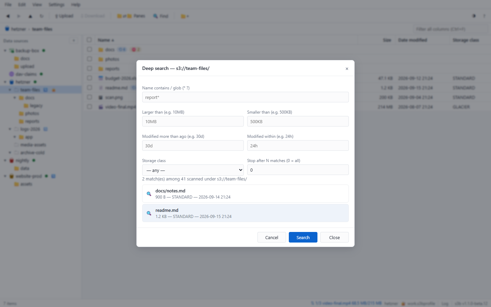

- **Dual pane** — F9 opens a local-filesystem pane (or another source)
  beside the main view, WinSCP-style: drag between panes, synchronized
  browsing, and **Compare** color-codes newer / older / size-diff /
  only-here between the two sides.

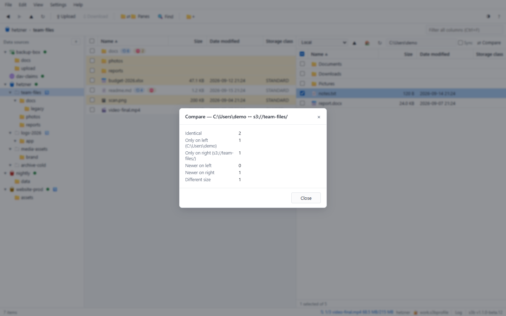

- **Light/dark theme** and 15 built-in languages (English default,
  auto-detect optional) — switchable in Settings.

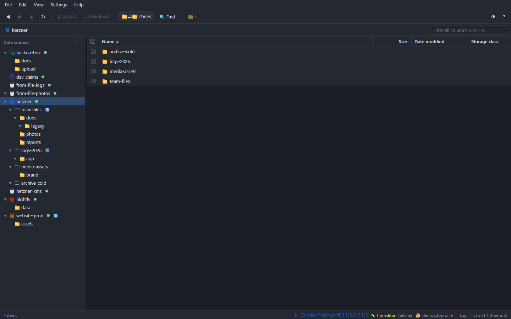

---

## 4. Transfers — and migrating between sources

Every combination of the sources above transfers through the same
engine, which makes **migration** — S3 → SFTP, WebDAV → S3, local →
R2, MinIO → Wasabi — a drag or a `cp` away.

- **Upload** — the toolbar ▲ button and every context menu open one
  Upload flyout: **Files… (Ctrl+U)** picks files, **Folder…** a whole
  directory tree — or just drag files/folders from the OS anywhere onto
  the window.
- **Download** — toolbar ▼, Ctrl+D, Enter, or the context menu.
  Multistep transfers are multipart and resumable per file.
- **Copy & move** — Ctrl+C / Ctrl+X / Ctrl+V, or drag rows onto folders,
  the tree, or the other pane. Same-source S3 copies run **server-side**
  (no traffic through you); hold Shift while dragging to force a move;
  cross-source drags spool through an encrypted temp workspace when
  Secure Storage is on.
- **Text instead of files** — the context menu (or Edit → Copy as)
  copies names, full paths or `s3://` URIs to the OS clipboard.
- **Conflicts & speed** — every transfer states a conflict policy
  (overwrite / skip / rename) with a live pre-check that lists exactly
  which files collide, and can be throttled (256 kB/s … 10 MB/s).
- **Transfer manager** — View → Transfers (or the status-bar counter)
  shows every job with per-file and byte-level progress, speed and
  cancel.

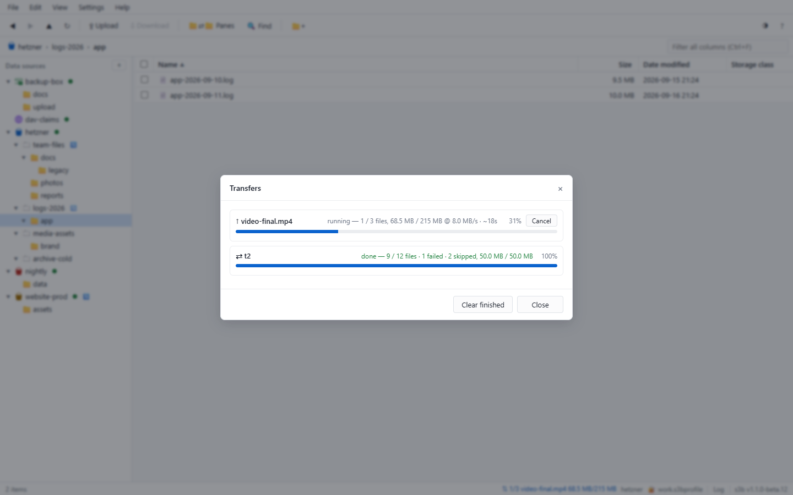

Closing the window or quitting while transfers still run — or with
unsaved profile work — asks first; nothing is dropped silently.

---

## 5. Versions & the safety ladder

The feature set most S3 tools treat as an afterthought.

- **Versioning** — enable it per bucket (Admin panel or
  `s3b bucket versioning s3://b on`). Versioned buckets show 🔄 in the
  tree; an object's context menu → **Versions** opens its timeline:
  restore a previous version as latest, view text diffs between
  versions, or destroy specific versions.

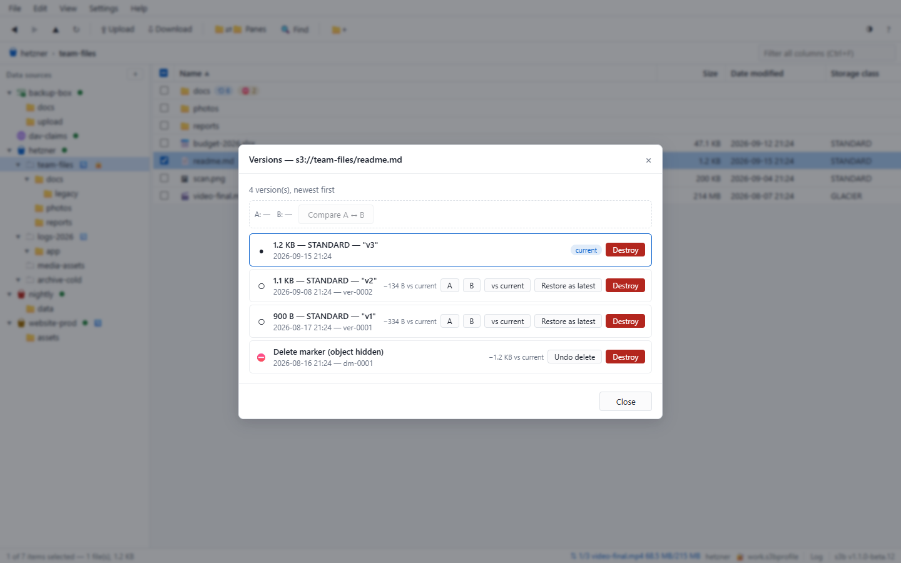

- **Undo delete** — deleting on a versioned bucket leaves a *delete
  marker*; **Versions → undo delete** brings the object back in one
  click (bulk-select works in the marker window). Rows with markers in
  their history carry a ⛔ badge; a folder whose every file is
  delete-marked shows *all deleted*.
- **One Delete Window, three types** — every delete counts first and
  acts second, on every source. On versioned buckets it offers:
  1. **Add a delete marker** (default) — everything stays restorable
  2. **Delete all except current version** — keep the latest, clear
     the history
  3. **Delete permanently** — purge every version and marker
  The destructive types state their consequence in an amber line and
  require a typed `delete`; Shift+Del jumps straight to the permanent
  path.

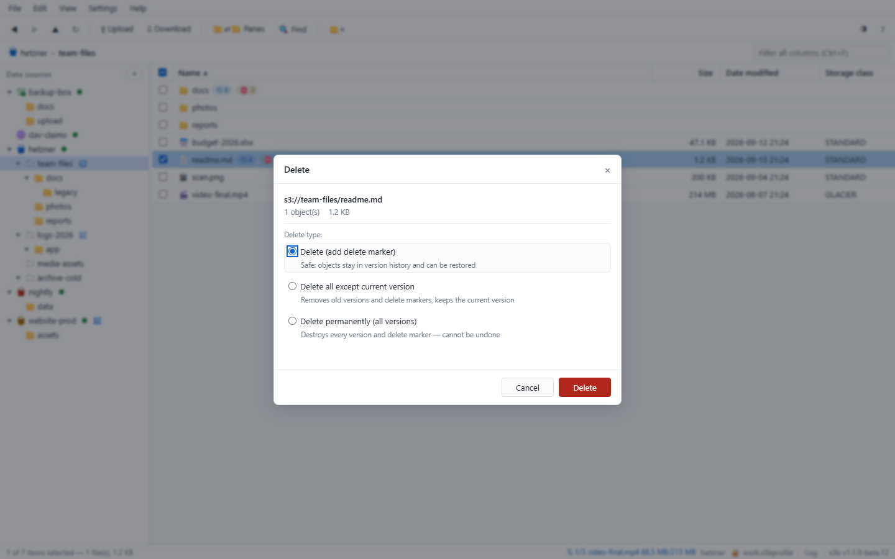

- **Object Lock** — enable at bucket creation only (permanent);
  per-version retention (GOVERNANCE / COMPLIANCE) and legal hold, with
  the same confirm gates as the CLI.
- **Bulk tools** — folder-level *Content Versions* overview, per-child
  version counts, bulk purge of noncurrent versions
  (`s3b versions purge`), and force-emptying a versioned bucket
  (markers included) via `rb --force`.

The ladder, formally:

| Level | Operations | Gate |
|---|---|---|
| L0 | delete selection, overwrite upload | count + confirm |
| L1 | ≥50 items, prefix delete, bulk class conversion | `--force` (CLI) / typed confirm (GUI) |
| L2 | empty/remove bucket, purge noncurrent | type the **bucket name** |
| L3 | destroy versions & markers | explicit destructive choice + typed `delete` |

---

## 6. Bucket administration

Right-click a bucket → **Admin panel**: one tabbed dialog for
versioning, policy, ACL, CORS, lifecycle rules, default encryption,
public-access block, static website and tags — plus a versions overview
and the object-lock tab. Everything the CLI's `s3b bucket …` tree
offers, same confirm gates.

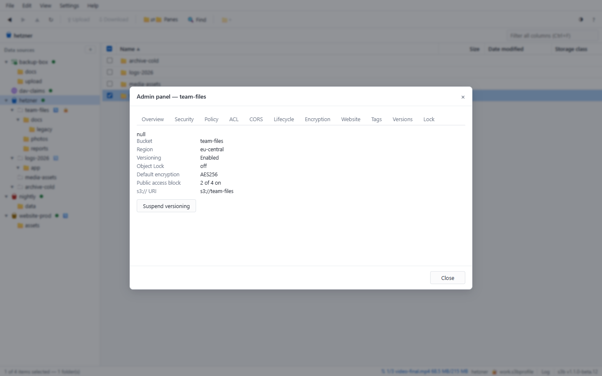

- **Doctor** — Help → Doctor (or `s3b doctor s3://bucket`) runs a guided
  diagnosis: DNS → TCP → TLS → auth → permissions, with plain-language
  remediation and one-click re-runs of individual checks.
- **Presign & storage class** — the context menu creates time-limited
  pre-signed URLs (computed locally) and converts objects between
  storage classes via server-side self-copy.
- **Properties** — full metadata for buckets, folders, objects and
  sources: provider, region, versioning, lock, encryption, policy
  state.

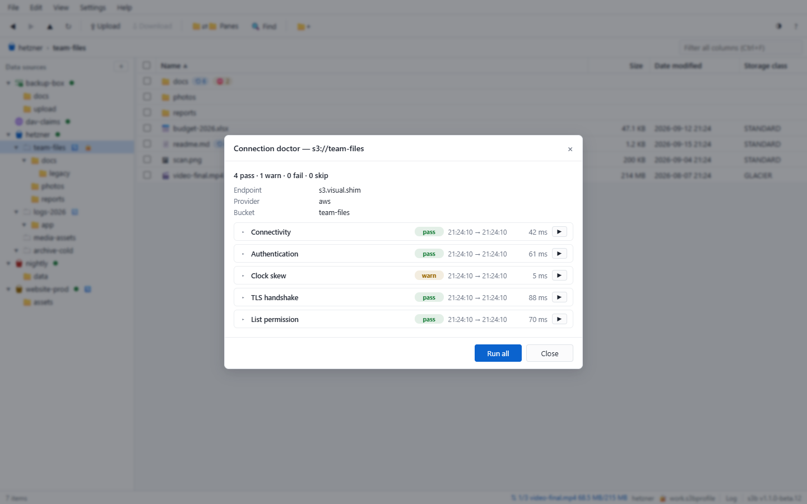

---

## 7. Security features

The short version of [security.md](security.md):

- **Secrets in the OS keyring** — never in files when a keyring exists;
  `0600` file fallback on headless hosts; masked in all output.
- **Encrypted profiles** — saved `.s3bprofile` workspaces are
  scrypt + AES-256-GCM containers.
- **Secure Storage** (Settings → Security) — opt-in mode that encrypts
  the whole source store as one AES-256-GCM envelope keyed from the OS
  keyring, moves temp workspaces into the protected config folder
  (wiped at every launch), turns file logging off, and auto-clears
  pre-signed URLs from the clipboard after 60 s. Built for terminal
  servers, jump boxes and USB-stick installs.

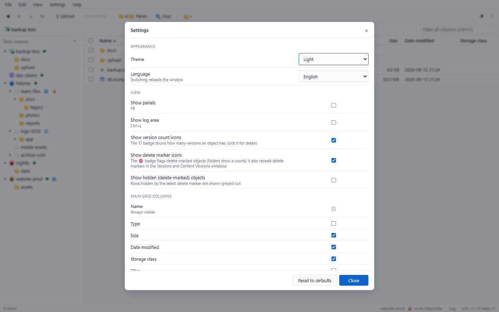

- **Portable mode** — drop an empty `s3b-portable` marker file next to
  the binary and all settings stay beside it — perfect for USB sticks
  ([README-portable](../README-portable.md)).
- **No telemetry, ever** — no metrics, no crash reports, no update
  pings; the binary talks only to the endpoints you configure.

---

## 8. Keyboard map

The full map ships in the app (Help → Keyboard shortcuts). The ones
you'll use daily:

| Keys | Action |
|---|---|
| Ctrl+F | focus quick filter |
| Ctrl+Shift+F | deep search |
| Ctrl+U / Ctrl+D | upload files / download selection |
| Ctrl+C / Ctrl+X / Ctrl+V | copy / cut / paste (OS clipboard mirror included) |
| Ctrl+A / Ctrl+I | select all / invert selection |
| Del / Shift+Del | delete window / permanent path |
| F9 | dual pane |
| Ctrl+L | event log |
| Ctrl+S | save workspace profile |
| F1 | help (in-app guide + key map) |

---

## 9. CLI quick reference

Same binary, same engine, same sources — `s3b` with arguments is the
CLI. The complete tree is in [cli.md](cli.md); the shape of it:

```bash
s3b profile add lab --endpoint http://localhost:9000 \
    --access-key minioadmin --secret-key minioadmin --default
s3b source add vault sftp://deploy@backups.example.com

s3b ls            s3b ls vault://media      # any source, same flags
s3b cp ./site s3://b/site/ -r               # upload (or download, or copy)
s3b cp s3://src-b/ sftp://host/dst/ -r      # cross-source migration
s3b sync ./site s3://b/site/ --delete
s3b find s3://b --name 'backup*' --older 90d
s3b doctor s3://my-bucket

s3b versions ls s3://b/docs/report.pdf      # timeline, newest first
s3b versions undo s3://b/docs/report.pdf --version-id MARKER
s3b versions purge s3://b --mode noncurrent --dry-run
s3b rb s3://old-bucket --force              # empties versioned buckets too
```

Every command takes `--json`, `--profile` and `--verbose`; shell
completions: `s3b completion bash|zsh|fish|powershell`.
